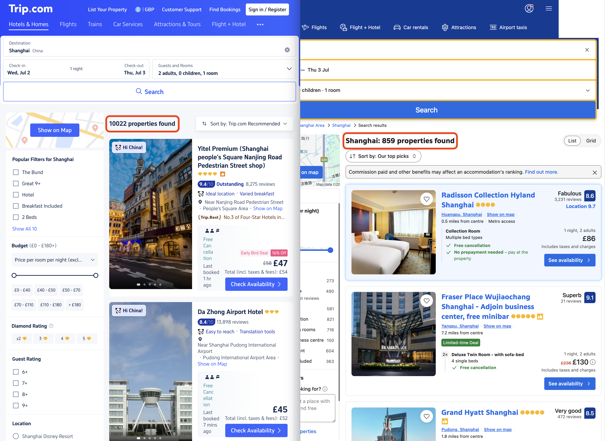
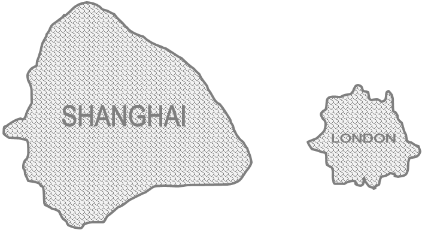

# Trip Planning Hacks

> Last updated on June 4th, 2025

```{note}
📬 If you have any hacks you would like to share/know, feel free to contact us through [**chinatrip.info.contact@gmail.com**](mailto:chinatrip.info.contact%40gmail.com), and we will follow up as soon as we can!
```

## 🌟 Timing: Picking the Right Time to Visit

```{dropdown} Planning your trip to China? Let's chat about the best times to go, considering festivals, weather, and a few surprises along the way. Here's what you need to know.
:open:

### 🗓️ Major Holidays

China's public holidays can transform the travel landscape. During these periods, transportation hubs are bustling, tourist attractions are crowded, and accommodations may be scarce or pricier.  Here's what to watch out in the short future:

- **Spring Festival (Chinese New Year)**: February 17th to March 3rd 2026. This is China's most significant holiday, akin to Christmas and New Year combined. Expect mass travel as families reunite, thus trains and flights are extremely hard to book.
- **International Labour Day**: (anticipated) May 1st to 5th 2026. A popular time for domestic travel, so expect crowds at tourist spots.
- **National Day & Mid-Autumn Festival**: October 1st to 8th 2025. The two holidays coincide, creating an extended "Golden Week." Major tourist destinations will be packed.

During these holidays, major cities like Beijing and Shanghai may feel less crowded as locals travel elsewhere. However, tourist destinations such as Hainan and Heilongjiang can become exceptionally busy.

### 🌡️ Weather Considerations

China's vast geography means a wide range of climates. Understanding regional weather patterns can help you pack appropriately and plan activities.

🔥 **Summer Heat**

Summers, especially from June to August, can be intensely hot and humid in many regions. Provinces/cities listed as follows often experience temperatures exceeding 40°C (104°F): Chongqing, Guangdong, Hainan, Hunan, Jiangxi, Sichuan, and Zhejiang.

If you're sensitive to heat, consider visiting northern provinces such as Gansu, Heilongjiang, Jilin, and Xinjiang (but not every city) for summer months. So, to maximise your probability of getting an enjoyable trip, we strongly suggest to check the weather forecast.

❄️ **Winter Cold**

Winters, particularly from December to February, can be harsh in northern and western China. For instance, Altay in Xinjiang can experience temperatures as low as <-50°C (-58°F). Ensure you're prepared for extreme cold if traveling during this season.

🌀 **Typhoon Season**

From July to September, southern coastal provinces like Guangdong, Fujian, and Hainan are susceptible to typhoons. These storms can disrupt travel plans with heavy rains and strong winds.

Keep an eye on weather forecasts if you're heading to these regions during this time. Flexibility is key!
```

---

## ✈️ Flights

We don't have much more than Skyscanner to recommend for booking flights to and back from China. If you're flying from Europe, **Shanghai** often emerges as the most budget-friendly destination, especially for travellers from countries like Italy. For those without a strong preference for specific airlines, consider opting for Chinese carriers, as they offer shorter flight durations.

---

## 🏨 Hotel

```{dropdown} Where to stay in China? We'll share our favorite booking platforms and hotel brands, plus some location tips that can save you hours of commuting.
:open:

### 🔍 Book on Trip.com

When it comes to booking hotels in China, we recommend [trip.com](http://trip.com) over [booking.com](http://booking.com).

To give you an idea: we did a quick test search for hotels in Shanghai (same dates, same number of guests). Trip.com gave us **>10,000** options, while booking.com showed only **859**. Not only that, the prices on trip.com were noticeably better.



Surely, there are some Chinese apps that offer even better deals and way more listings. But they often don’t come with English interfaces, and using them without knowing Chinese can be tricky. So unless you’ve got local help, trip.com is probably your best bet.

### 🛏️ Hotel Brands We Love — Ji & Atour (Not Sponsored, Promise!)


When it comes to hotels in China, we have our favorites. After all, we’ve been living here for years and have tried out a lot of places.

We’ve stayed in a lot of hotels across China, and our go-tos are **Ji Hotel** and **Atour Hotel**. Here’s why we keep coming back to them:

Our personal recommendation is Ji Hotel and Atour Hotel, two brands. Why them?

- **They’re everywhere**: Big city, small town, chances are you’ll find one of these two brands nearby.
- **Easy to reuse**: Once you’ve stayed at one, you’ll know the drill. Same check-in flow, same kind of room, same amenities, and same services everywhere.
- **Great value**: For around €100 or £100, you can usually get a very nice room (enough for two adults and a kid), **plus** free laundry, free gym access, and a great location.
- **Seriously comfy beds at Atour**: It's a running joke that Atour opens hotels just to market their pillows and mattresses. Some say the real business is bedding, not lodging! Honestly, we don’t mind, their pillows and mattresses are amazing.

### ⚠️ Notes on location - stay close to metro



One tip we always share: try to stay close to a metro station. Traffic in Chinese cities like Beijing and Shanghai can get intense, especially during rush hours. The metro, on the other hand, is fast, cheap, and reliable!

Also, be mindful of city size! Take Shanghai for example, it can take **>2 hours** to go from one airport to the other by metro. (Yes, that’s why they built a high-speed airport line.) So before you book, pull up [amap.com](http://amap.com/) (it’s like Google Maps but for China) and check your hotel’s distance from places you want to visit. Otherwise, you might end up commuting over an hour just to get to the city centre.

We’ll talk more about hotel booking, must-knows, and what to avoid in [China Travel 101 – Accommodation](../china_trip_101/hotel). Stay tuned!
```

---

Want the full picture? Head over to [China Trip 101](../china_trip_101/index) for all the juicy details and tips we couldn’t squeeze in here.